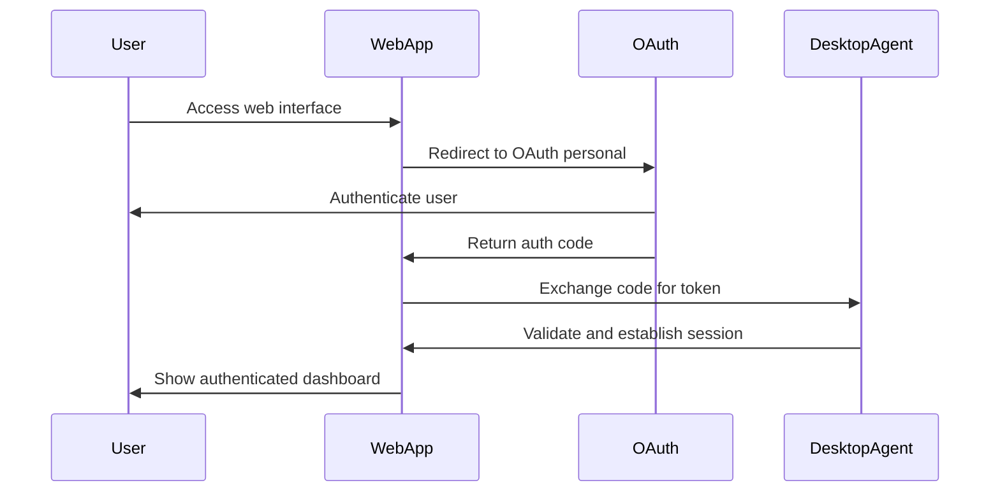

# 🚀 Phase A: Remote Desktop Control & Web Interface

*"Establish reliable controls of the remote desktop and a website accessible through the internet"*

## 🎯 Phase A Overview

**Mission**: Build the foundational infrastructure for remote desktop control with a secure, internet-accessible web interface using OAuth personal authentication.

**Timeline**: 2-3 weeks
**Priority**: CRITICAL - Foundation for all subsequent phases

## 🏗️ Phase A Architecture

```
┌─────────────────┐    ┌──────────────────┐    ┌─────────────────┐
│   Web Interface │◄──►│  OAuth Personal  │◄──►│  Desktop Agent  │
│   (Internet)    │    │  Authentication  │    │  (Home PC)      │
└─────────────────┘    └──────────────────┘    └─────────────────┘
```

### Core Components

1. **Desktop Agent** (Cursor Squad)
   - OAuth personal authentication
   - Remote control capabilities
   - System monitoring and health checks
   - Secure communication endpoint

2. **Web Interface** (Dev Team)
   - Internet-accessible website
   - OAuth personal login
   - Remote desktop control interface
   - Real-time status monitoring

3. **Authentication Layer** (Both Teams)
   - OAuth personal implementation
   - Secure token management
   - User session handling

## 📋 Phase A Development Roadmap

### Week 1: Foundation & Authentication

#### Day 1-2: Project Setup & OAuth Research
**Team**: Both Teams
**Deliverables**:
- [ ] Initialize Node.js projects in all component directories
- [ ] Research OAuth personal implementation patterns
- [ ] Set up development environment and tooling
- [ ] Create basic project structure and configuration

**Tasks**:
- **Cursor Squad**: Research OAuth personal for desktop applications
- **Dev Team**: Set up React/Next.js project for web interface
- **Both Teams**: Establish shared development standards

#### Day 3-4: OAuth Personal Implementation
**Team**: Both Teams
**Deliverables**:
- [ ] OAuth personal authentication flow design
- [ ] Basic authentication endpoints
- [ ] Token management system
- [ ] User session handling

**Tasks**:
- **API Architect**: Design OAuth personal flow
- **Backend Architect**: Implement authentication endpoints
- **Security Specialist**: Review security implementation
- **Frontend Lead**: Design login interface

#### Day 5-7: Basic Communication Layer
**Team**: Both Teams
**Deliverables**:
- [ ] WebSocket connection between web interface and desktop agent
- [ ] Basic message protocol
- [ ] Connection health monitoring
- [ ] Error handling and reconnection logic

**Tasks**:
- **Backend Architect**: Implement WebSocket server
- **Desktop Specialist**: Implement WebSocket client
- **Frontend Lead**: Implement WebSocket connection in web interface

### Week 2: Remote Control Implementation

#### Day 8-10: Desktop Agent Core
**Team**: Cursor Squad
**Deliverables**:
- [ ] Desktop agent with OAuth authentication
- [ ] Basic system monitoring capabilities
- [ ] Remote control command interface
- [ ] Health check endpoints

**Tasks**:
- **Cursor Expert**: Implement OAuth personal in desktop agent
- **Desktop Specialist**: Build system monitoring and control interface
- **Security Specialist**: Implement secure command execution
- **API Architect**: Design remote control API

#### Day 11-12: Web Interface Core
**Team**: Dev Team
**Deliverables**:
- [ ] OAuth personal login interface
- [ ] Basic dashboard for remote control
- [ ] Real-time status display
- [ ] Responsive mobile-first design

**Tasks**:
- **Frontend Lead**: Build login and dashboard interfaces
- **Mobile Specialist**: Implement responsive design
- **Backend Architect**: Integrate with OAuth personal
- **DevOps Engineer**: Set up development deployment

#### Day 13-14: Integration & Testing
**Team**: Both Teams
**Deliverables**:
- [ ] End-to-end authentication flow
- [ ] Basic remote control functionality
- [ ] Connection stability testing
- [ ] Security testing and validation

**Tasks**:
- **Both Teams**: Integration testing
- **Security Specialist**: Security audit
- **DevOps Engineer**: Performance testing

### Week 3: Polish & Production Readiness

#### Day 15-17: Enhanced Remote Control
**Team**: Cursor Squad
**Deliverables**:
- [ ] Advanced remote control capabilities
- [ ] System health monitoring dashboard
- [ ] Logging and error reporting
- [ ] Performance optimization

**Tasks**:
- **Desktop Specialist**: Implement advanced control features
- **API Architect**: Enhance remote control API
- **Security Specialist**: Implement comprehensive logging

#### Day 18-19: Enhanced Web Interface
**Team**: Dev Team
**Deliverables**:
- [ ] Enhanced dashboard with real-time monitoring
- [ ] Mobile-optimized interface
- [ ] User experience improvements
- [ ] Performance optimization

**Tasks**:
- **Frontend Lead**: Enhance dashboard functionality
- **Mobile Specialist**: Optimize mobile experience
- **DevOps Engineer**: Performance optimization

#### Day 20-21: Production Deployment
**Team**: Both Teams
**Deliverables**:
- [ ] Production deployment setup
- [ ] Monitoring and alerting
- [ ] Documentation completion
- [ ] User acceptance testing

**Tasks**:
- **DevOps Engineer**: Production deployment
- **Both Teams**: Final testing and documentation
- **Security Specialist**: Production security review

## 🔐 OAuth Personal Implementation

### Authentication Flow


### Security Considerations
- **Token Storage**: Secure token storage on desktop agent
- **Session Management**: Secure session handling
- **Communication**: Encrypted WebSocket communication
- **Access Control**: Role-based access control
- **Audit Logging**: Comprehensive security logging

## 🎯 Success Criteria

### Technical Metrics
- [ ] **Authentication Success Rate**: > 99%
- [ ] **Connection Stability**: > 99.9% uptime
- [ ] **Response Time**: < 2 seconds for web interface
- [ ] **Security**: Zero critical vulnerabilities

### User Experience Metrics
- [ ] **Login Flow**: < 30 seconds to authenticated state
- [ ] **Mobile Responsiveness**: Perfect on all mobile devices
- [ ] **Error Handling**: Clear error messages and recovery
- [ ] **Accessibility**: WCAG 2.1 AA compliance

### Business Metrics
- [ ] **Remote Access**: Successfully control desktop from anywhere
- [ ] **Security**: Secure authentication without server infrastructure
- [ ] **Scalability**: Support for multiple users and devices
- [ ] **Reliability**: Consistent performance across different networks

## 🚨 Risk Mitigation

### Technical Risks
- **OAuth Personal Complexity**: Start with simple implementation, iterate
- **WebSocket Reliability**: Implement robust reconnection logic
- **Security Vulnerabilities**: Regular security reviews and testing
- **Performance Issues**: Continuous monitoring and optimization

### Project Risks
- **Timeline Delays**: Buffer time for research and integration
- **Scope Creep**: Focus on core remote control functionality
- **Technical Debt**: Regular refactoring and cleanup
- **User Adoption**: Focus on intuitive user experience

## 📊 Phase A Metrics & Monitoring

### Development Metrics
- **Code Quality**: > 80% test coverage
- **Build Success Rate**: > 95%
- **Deployment Success Rate**: > 90%
- **Documentation Completeness**: 100%

### Operational Metrics
- **System Uptime**: > 99.9%
- **Authentication Success Rate**: > 99%
- **Connection Stability**: > 99.5%
- **User Satisfaction**: > 4.5/5

## 🔄 Phase A Exit Criteria

### Must Have
- [ ] OAuth personal authentication working end-to-end
- [ ] Basic remote desktop control functionality
- [ ] Internet-accessible web interface
- [ ] Secure communication between components
- [ ] Mobile-responsive design
- [ ] Comprehensive error handling
- [ ] Basic monitoring and logging

### Should Have
- [ ] Advanced remote control features
- [ ] Real-time system monitoring
- [ ] Performance optimization
- [ ] Enhanced user experience
- [ ] Production deployment ready

### Could Have
- [ ] Advanced security features
- [ ] Multi-user support
- [ ] Advanced monitoring dashboard
- [ ] API documentation
- [ ] User guides and tutorials

## 🎉 Phase A Success Celebration

### Milestone Achievements
- [ ] **First OAuth Authentication** 🎉
- [ ] **First Remote Desktop Connection** 🎉
- [ ] **First Internet-Accessible Interface** 🎉
- [ ] **First End-to-End Remote Control** 🎉

### Team Recognition
- **Cursor Squad**: Mastering OAuth personal and desktop control
- **Dev Team**: Building responsive, secure web interface
- **Cross-Team Collaboration**: Seamless integration and communication

---

## 🚀 Phase A Wisdom

*"Phase A is the foundation upon which everything else is built. Get it right, and the rest becomes much easier."*

**Remember**: Focus on reliability, security, and user experience. A solid foundation in Phase A will enable rapid development in subsequent phases.

*Last Updated: [Current Date]*
*Version: 1.0*
