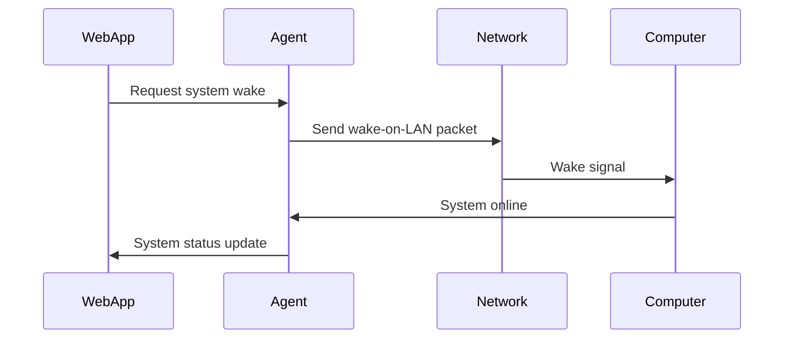
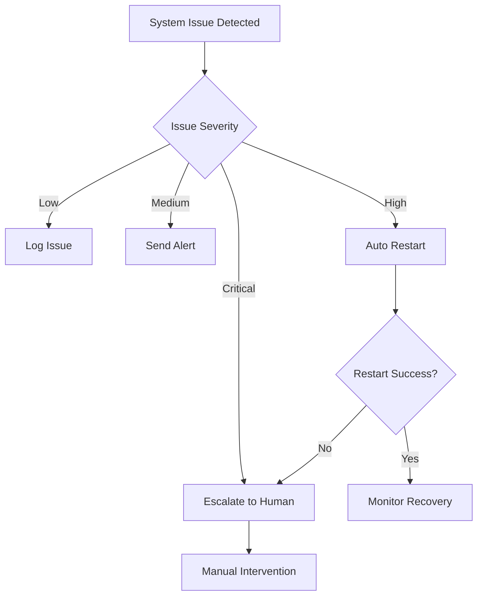

# 🛡️ Phase B: System Reliability & Advanced Remote Control

*"Test and bulletproof the system with advanced remote control capabilities"*

## 🎯 Phase B Overview

**Mission**: Transform the basic remote control system into a bulletproof, enterprise-grade solution with advanced recovery capabilities, system resilience, and full Cursor integration.

**Timeline**: 2-3 weeks  
**Priority**: CRITICAL - System reliability and advanced features  
**Prerequisites**: Phase A completion

## 🏗️ Phase B Architecture

```
┌─────────────────┐    ┌──────────────────┐    ┌─────────────────┐
│   Web Interface │◄──►│  Advanced Agent  │◄──►│  System Control │
│   (Enhanced)    │    │  (Resilient)     │    │  & Recovery     │
└─────────────────┘    └──────────────────┘    └─────────────────┘
                              │
                              ▼
                    ┌──────────────────┐
                    │  Cursor Control  │
                    │  & Integration   │
                    └──────────────────┘
```

### Core Components

1. **Enhanced Desktop Agent** (Cursor Squad)
   - System recovery and wake-on-LAN capabilities
   - Advanced health monitoring and diagnostics
   - Automatic restart and escalation procedures
   - Cursor window startup and control

2. **Advanced Web Interface** (Dev Team)
   - System status dashboard with recovery controls
   - Real-time health monitoring and alerts
   - Advanced remote control capabilities
   - Cursor window management interface

3. **System Recovery Layer** (Both Teams)
   - Wake-on-LAN implementation
   - Automatic restart procedures
   - Escalation and alerting system
   - Health check and diagnostics

## 📋 Phase B Development Roadmap

### Week 1: System Recovery & Resilience

#### Day 1-2: Wake-on-LAN & System Recovery Research
**Team**: Cursor Squad
**Deliverables**:
- [ ] Wake-on-LAN implementation research
- [ ] System recovery procedures design
- [ ] Network discovery and connectivity testing
- [ ] Hardware compatibility assessment

**Tasks**:
- **Desktop Specialist**: Research wake-on-LAN implementation
- **Security Specialist**: Design secure recovery procedures
- **API Architect**: Design recovery API endpoints
- **Cursor Expert**: Research system startup procedures

#### Day 3-4: System Recovery Implementation
**Team**: Cursor Squad
**Deliverables**:
- [ ] Wake-on-LAN functionality
- [ ] System startup automation
- [ ] Network connectivity restoration
- [ ] Recovery time optimization

**Tasks**:
- **Desktop Specialist**: Implement wake-on-LAN
- **Security Specialist**: Implement secure recovery
- **API Architect**: Build recovery API
- **Cursor Expert**: Implement system startup

#### Day 5-7: Health Monitoring & Diagnostics
**Team**: Both Teams
**Deliverables**:
- [ ] Advanced health monitoring system
- [ ] Real-time diagnostics dashboard
- [ ] Predictive failure detection
- [ ] Performance optimization

**Tasks**:
- **Desktop Specialist**: Build health monitoring
- **Backend Architect**: Implement diagnostics API
- **Frontend Lead**: Create diagnostics dashboard
- **DevOps Engineer**: Set up monitoring infrastructure

### Week 2: Advanced Remote Control & Cursor Integration

#### Day 8-10: Cursor Window Control Research
**Team**: Cursor Squad
**Deliverables**:
- [ ] Cursor API integration research
- [ ] Window management capabilities
- [ ] Process control and monitoring
- [ ] Cursor startup automation

**Tasks**:
- **Cursor Expert**: Research Cursor APIs and integration
- **Desktop Specialist**: Implement window management
- **API Architect**: Design Cursor control API
- **Security Specialist**: Secure Cursor integration

#### Day 11-12: Cursor Integration Implementation
**Team**: Cursor Squad
**Deliverables**:
- [ ] Remote Cursor window startup
- [ ] Cursor process monitoring
- [ ] Window state management
- [ ] Cursor control interface

**Tasks**:
- **Cursor Expert**: Implement Cursor startup and control
- **Desktop Specialist**: Build process monitoring
- **API Architect**: Implement Cursor control API
- **Security Specialist**: Secure Cursor operations

#### Day 13-14: Advanced Web Interface
**Team**: Dev Team
**Deliverables**:
- [ ] Enhanced system status dashboard
- [ ] Cursor window management interface
- [ ] Recovery control panel
- [ ] Advanced monitoring displays

**Tasks**:
- **Frontend Lead**: Build enhanced dashboard
- **Mobile Specialist**: Optimize mobile interface
- **Backend Architect**: Implement advanced APIs
- **DevOps Engineer**: Deploy enhanced interface

### Week 3: Escalation & Production Hardening

#### Day 15-17: Escalation & Alerting System
**Team**: Both Teams
**Deliverables**:
- [ ] Multi-level escalation procedures
- [ ] Automated alerting system
- [ ] Emergency restart capabilities
- [ ] Incident response automation

**Tasks**:
- **Security Specialist**: Design escalation procedures
- **Backend Architect**: Implement alerting system
- **Frontend Lead**: Build alert management interface
- **DevOps Engineer**: Set up monitoring and alerting

#### Day 18-19: System Hardening & Security
**Team**: Both Teams
**Deliverables**:
- [ ] Security hardening implementation
- [ ] Penetration testing
- [ ] Vulnerability assessment
- [ ] Security documentation

**Tasks**:
- **Security Specialist**: Implement security hardening
- **Both Teams**: Conduct security testing
- **DevOps Engineer**: Security infrastructure setup
- **API Architect**: Secure API endpoints

#### Day 20-21: Production Testing & Deployment
**Team**: Both Teams
**Deliverables**:
- [ ] End-to-end system testing
- [ ] Performance optimization
- [ ] Production deployment
- [ ] User acceptance testing

**Tasks**:
- **Both Teams**: Comprehensive system testing
- **DevOps Engineer**: Production deployment
- **Security Specialist**: Final security review
- **Both Teams**: Documentation and training

## 🔄 System Recovery Capabilities

### Wake-on-LAN Implementation


### Recovery Time Targets
- **Wake-on-LAN**: < 2 minutes
- **System Startup**: < 5 minutes
- **Network Connectivity**: < 1 minute
- **Agent Startup**: < 2 minutes
- **Total Recovery Time**: < 10 minutes

### Escalation Procedures


## 🎯 Success Criteria

### Recovery Metrics
- [ ] **System Recovery Time**: < 10 minutes from offline to fully operational
- [ ] **Wake-on-LAN Success Rate**: > 95%
- [ ] **Automatic Recovery Success Rate**: > 90%
- [ ] **Escalation Response Time**: < 5 minutes

### Cursor Integration Metrics
- [ ] **Cursor Startup Time**: < 30 seconds
- [ ] **Window Control Response**: < 2 seconds
- [ ] **Process Monitoring Accuracy**: > 99%
- [ ] **Integration Reliability**: > 99.5%

### System Reliability Metrics
- [ ] **System Uptime**: > 99.9%
- [ ] **Recovery Success Rate**: > 95%
- [ ] **False Positive Rate**: < 1%
- [ ] **Mean Time to Recovery**: < 5 minutes

## 🚨 Advanced Risk Mitigation

### System Recovery Risks
- **Hardware Compatibility**: Test wake-on-LAN on target hardware
- **Network Issues**: Implement multiple recovery methods
- **Security Vulnerabilities**: Secure all recovery procedures
- **Performance Impact**: Optimize recovery procedures

### Cursor Integration Risks
- **API Limitations**: Research Cursor APIs thoroughly
- **Process Conflicts**: Handle multiple Cursor instances
- **Security Concerns**: Secure Cursor control access
- **Performance Impact**: Optimize Cursor operations

### Escalation Risks
- **False Alerts**: Implement intelligent alerting
- **Response Delays**: Automate escalation procedures
- **Human Error**: Provide clear escalation guidelines
- **System Overload**: Implement rate limiting

## 📊 Phase B Metrics & Monitoring

### Recovery Metrics
- **Recovery Time**: Average time from offline to online
- **Recovery Success Rate**: Percentage of successful recoveries
- **Wake-on-LAN Success Rate**: Percentage of successful wake attempts
- **Escalation Frequency**: Number of escalations per week

### Cursor Integration Metrics
- **Cursor Startup Success Rate**: Percentage of successful startups
- **Window Control Response Time**: Time to window state change
- **Process Monitoring Accuracy**: Accuracy of process state detection
- **Integration Uptime**: Cursor integration availability

### System Health Metrics
- **System Uptime**: Overall system availability
- **Health Check Success Rate**: Percentage of successful health checks
- **Alert Accuracy**: Percentage of accurate alerts
- **Performance Impact**: System performance with monitoring

## 🔄 Phase B Exit Criteria

### Must Have
- [ ] Wake-on-LAN functionality working reliably
- [ ] System recovery within 10 minutes
- [ ] Cursor window startup and control
- [ ] Multi-level escalation system
- [ ] Advanced health monitoring
- [ ] Comprehensive security hardening
- [ ] Production-ready deployment

### Should Have
- [ ] Predictive failure detection
- [ ] Automated incident response
- [ ] Advanced Cursor integration features
- [ ] Mobile-optimized recovery interface
- [ ] Comprehensive monitoring dashboard
- [ ] Performance optimization

### Could Have
- [ ] Machine learning-based failure prediction
- [ ] Advanced automation workflows
- [ ] Multi-computer management
- [ ] Advanced Cursor automation
- [ ] Integration with external monitoring tools
- [ ] Advanced analytics and reporting

## 🎉 Phase B Success Celebration

### Milestone Achievements
- [ ] **First Wake-on-LAN Success** 🎉
- [ ] **First 10-Minute Recovery** 🎉
- [ ] **First Remote Cursor Startup** 🎉
- [ ] **First Automated Escalation** 🎉

### Team Recognition
- **Cursor Squad**: Mastering system recovery and Cursor integration
- **Dev Team**: Building bulletproof monitoring and control interfaces
- **Cross-Team Collaboration**: Seamless escalation and recovery procedures

## 🔧 Technical Implementation Details

### Wake-on-LAN Implementation
```javascript
// Wake-on-LAN Implementation
class WakeOnLAN {
  constructor(targetMAC) {
    this.targetMAC = targetMAC;
    this.magicPacket = this.createMagicPacket();
  }

  createMagicPacket() {
    // Create magic packet: 6 bytes of 0xFF + 16 repetitions of target MAC
    const header = Buffer.alloc(6, 0xFF);
    const mac = Buffer.from(this.targetMAC.replace(/:/g, ''), 'hex');
    const body = Buffer.alloc(16 * 6);
    
    for (let i = 0; i < 16; i++) {
      mac.copy(body, i * 6);
    }
    
    return Buffer.concat([header, body]);
  }

  async sendWakePacket() {
    // Send magic packet to broadcast address
    const dgram = require('dgram');
    const socket = dgram.createSocket('udp4');
    
    return new Promise((resolve, reject) => {
      socket.send(this.magicPacket, 9, '255.255.255.255', (error) => {
        socket.close();
        if (error) reject(error);
        else resolve();
      });
    });
  }
}
```

### Cursor Integration
```javascript
// Cursor Window Control
class CursorController {
  constructor() {
    this.cursorProcess = null;
    this.windowState = 'unknown';
  }

  async startCursor() {
    const { spawn } = require('child_process');
    
    this.cursorProcess = spawn('cursor', [], {
      detached: true,
      stdio: 'ignore'
    });
    
    return new Promise((resolve, reject) => {
      this.cursorProcess.on('error', reject);
      this.cursorProcess.on('spawn', resolve);
    });
  }

  async getCursorWindows() {
    // Use Windows API or similar to get Cursor window handles
    const { exec } = require('child_process');
    
    return new Promise((resolve, reject) => {
      exec('tasklist /FI "IMAGENAME eq cursor.exe"', (error, stdout) => {
        if (error) reject(error);
        else resolve(this.parseCursorWindows(stdout));
      });
    });
  }

  async focusCursorWindow(windowId) {
    // Focus specific Cursor window
    const { exec } = require('child_process');
    
    return new Promise((resolve, reject) => {
      exec(`powershell -command "Add-Type -TypeDefinition 'using System; using System.Runtime.InteropServices; public class Win32 { [DllImport(\"user32.dll\")] public static extern bool SetForegroundWindow(IntPtr hWnd); }'; Win32::SetForegroundWindow(${windowId})"`, (error) => {
        if (error) reject(error);
        else resolve();
      });
    });
  }
}
```

### Escalation System
```javascript
// Escalation Manager
class EscalationManager {
  constructor() {
    this.escalationLevels = {
      LOW: { timeout: 300000, action: 'log' },      // 5 minutes
      MEDIUM: { timeout: 60000, action: 'alert' },  // 1 minute
      HIGH: { timeout: 30000, action: 'restart' },  // 30 seconds
      CRITICAL: { timeout: 10000, action: 'escalate' } // 10 seconds
    };
  }

  async handleIssue(issue) {
    const level = this.escalationLevels[issue.severity];
    
    switch (level.action) {
      case 'log':
        await this.logIssue(issue);
        break;
      case 'alert':
        await this.sendAlert(issue);
        break;
      case 'restart':
        await this.autoRestart(issue);
        break;
      case 'escalate':
        await this.escalateToHuman(issue);
        break;
    }
  }

  async autoRestart(issue) {
    // Implement automatic restart logic
    const recovery = new SystemRecovery();
    const success = await recovery.restartSystem();
    
    if (!success) {
      await this.escalateToHuman(issue);
    }
  }

  async escalateToHuman(issue) {
    // Send emergency notification
    await this.sendEmergencyAlert(issue);
    await this.createIncidentTicket(issue);
  }
}
```

---

## 🛡️ Phase B Wisdom

*"Phase B transforms a working system into a bulletproof, enterprise-grade solution that you can trust with your most critical operations."*

**Remember**: Focus on reliability, automation, and intelligent escalation. A system that can recover itself and escalate intelligently is worth its weight in gold.

*Last Updated: [Current Date]*
*Version: 1.0*
