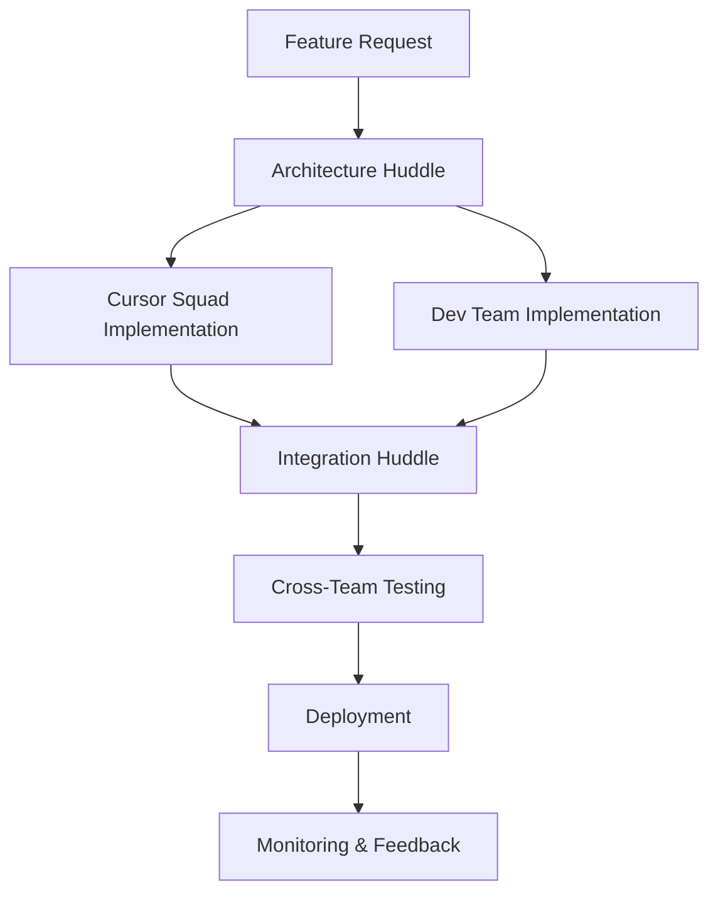
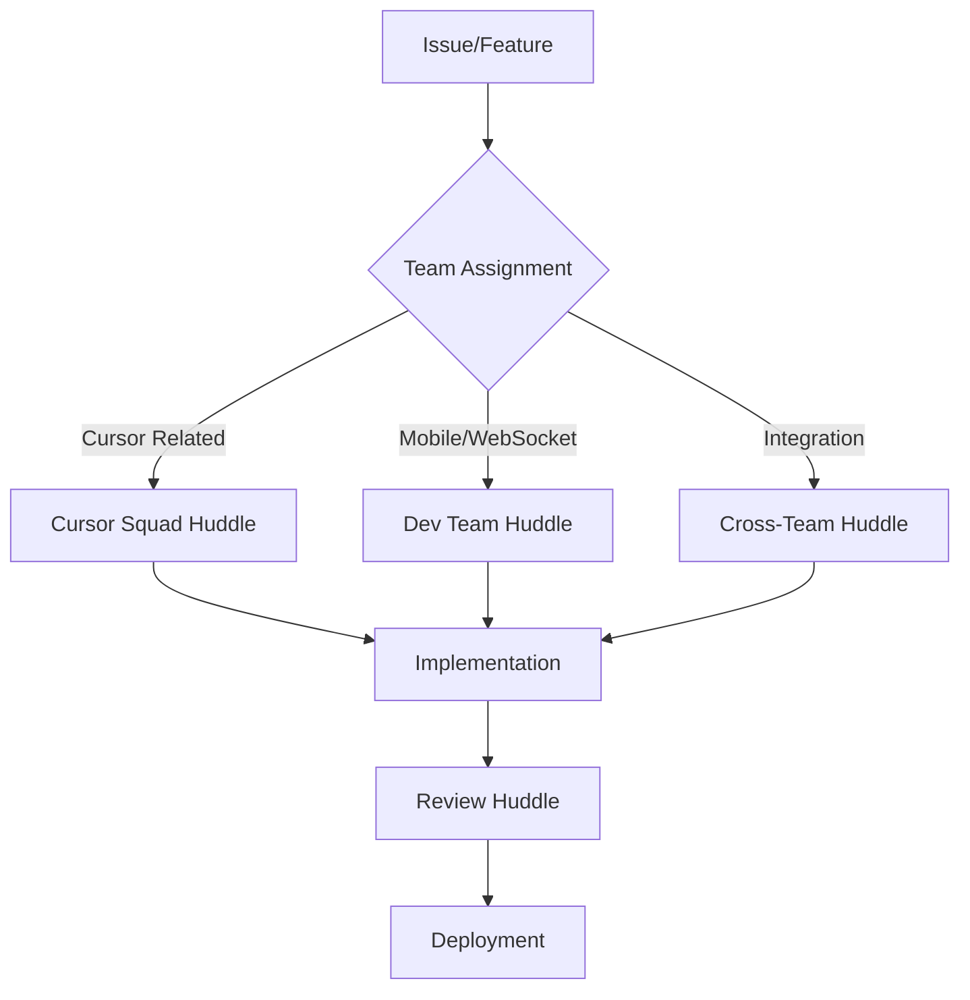

# 🏗️ Team Structure - RemoteCursor Expert Teams

*"The right team, the right expertise, the right time."*

## 🎯 Team Overview

RemoteCursor operates with two specialized expert teams that work together to deliver the project's vision. Each team has distinct responsibilities, expertise areas, and collaboration patterns.

## 🦸‍♂️ Expert Teams

### 1. **Cursor Squad** 🎯
**Mission**: Master Cursor integration and desktop agent development

#### Team Composition
- **Cursor Expert** (Lead): Deep knowledge of Cursor's API, extensions, and integration patterns
- **Desktop Specialist**: Expert in desktop application development and system integration
- **API Architect**: Designs and implements Cursor communication protocols
- **Security Specialist**: Ensures secure desktop-to-mobile communication

#### Core Responsibilities
- **Cursor Integration**: Research and implement Cursor API integration
- **Desktop Agent Development**: Build and maintain the desktop agent component
- **System Integration**: Interface with local Cursor processes and files
- **Security Implementation**: Implement secure authentication and data transmission
- **Performance Optimization**: Ensure desktop agent efficiency and reliability

#### Expertise Areas
- Cursor API and extension development
- Desktop application development (Node.js, Electron)
- System process management and monitoring
- Local file system integration
- Security and authentication protocols
- Performance monitoring and optimization

#### Key Deliverables
- Desktop agent with Cursor integration
- Secure authentication system
- Real-time chat submission capability
- Chat history management
- System health monitoring
- Error handling and recovery

### 2. **Dev Team** 💻
**Mission**: Build the mobile interface and WebSocket bridge infrastructure

#### Team Composition
- **Frontend Lead**: Expert in mobile web development and React/Next.js
- **Backend Architect**: Designs and implements WebSocket bridge and server infrastructure
- **Mobile Specialist**: Focuses on mobile-first responsive design and UX
- **DevOps Engineer**: Manages deployment, monitoring, and infrastructure

#### Core Responsibilities
- **Mobile Web App**: Develop responsive mobile web interface
- **WebSocket Bridge**: Build real-time communication infrastructure
- **User Experience**: Design intuitive mobile interface for remote Cursor access
- **Infrastructure**: Set up and maintain development and production environments
- **Performance**: Optimize for mobile constraints and network conditions

#### Expertise Areas
- React/Next.js development
- WebSocket and real-time communication
- Mobile-first responsive design
- Progressive Web App (PWA) development
- Backend API development
- DevOps and deployment automation
- Performance optimization for mobile

#### Key Deliverables
- Mobile-responsive web application
- WebSocket bridge server
- Real-time communication protocol
- User authentication interface
- Chat composition and management UI
- Deployment and monitoring infrastructure

## 🤝 Team Collaboration

### Cross-Team Responsibilities
- **Architecture Alignment**: Ensure components work together seamlessly
- **API Design**: Collaborate on communication protocols and data formats
- **Security Review**: Joint security audits and vulnerability assessments
- **Performance Testing**: End-to-end performance optimization
- **Documentation**: Shared technical documentation and user guides

### Communication Channels
- **Daily Standups**: Quick status updates and blocker identification
- **Technical Huddles**: Deep-dive technical discussions and decision-making
- **Architecture Reviews**: Cross-team architecture validation
- **Code Reviews**: Cross-team code review for integration points
- **Sprint Planning**: Joint planning and dependency management

## 🚀 Huddle Integration

### Team-Specific Huddle Types

#### Cursor Squad Huddles
```markdown
### Cursor Integration Huddle
**Purpose**: Solve Cursor API integration challenges
**Participants**: Cursor Squad members + Dev Team API Architect
**Duration**: 45-60 minutes
**Examples**:
- Cursor API authentication implementation
- Desktop agent process management
- Security protocol design
- Performance optimization strategies

### Desktop Agent Huddle
**Purpose**: Desktop agent development and system integration
**Participants**: Cursor Squad members
**Duration**: 30-45 minutes
**Examples**:
- Process monitoring implementation
- File system integration
- Error handling strategies
- Local security measures
```

#### Dev Team Huddles
```markdown
### Mobile Development Huddle
**Purpose**: Mobile web app development and UX design
**Participants**: Dev Team members + Cursor Squad UX input
**Duration**: 45-60 minutes
**Examples**:
- Mobile interface design decisions
- Responsive layout implementation
- PWA feature development
- Performance optimization

### WebSocket Bridge Huddle
**Purpose**: Real-time communication infrastructure
**Participants**: Dev Team members + Cursor Squad API Architect
**Duration**: 45-60 minutes
**Examples**:
- WebSocket protocol design
- Message format standardization
- Connection management
- Error handling and recovery
```

#### Cross-Team Huddles
```markdown
### Integration Huddle
**Purpose**: Ensure seamless component integration
**Participants**: Both teams' leads and architects
**Duration**: 60 minutes
**Examples**:
- API compatibility validation
- Data format standardization
- Security protocol alignment
- Performance testing coordination

### Architecture Review Huddle
**Purpose**: Review and validate system architecture
**Participants**: Both teams' architects and leads
**Duration**: 45-60 minutes
**Examples**:
- System architecture validation
- Component interaction review
- Scalability planning
- Security architecture review
```

## 📋 Team Workflows

### Development Workflow


### Huddle Workflow by Team


## 🎯 Team Metrics & KPIs

### Cursor Squad Metrics
- **Cursor Integration Success Rate**: % of successful Cursor API integrations
- **Desktop Agent Uptime**: System availability and reliability
- **Security Incident Rate**: Number of security issues per sprint
- **Performance Optimization**: Response time improvements
- **Documentation Quality**: Completeness and accuracy of Cursor integration docs

### Dev Team Metrics
- **Mobile App Performance**: Page load times and responsiveness
- **WebSocket Reliability**: Connection stability and message delivery
- **User Experience Score**: Mobile interface usability metrics
- **Deployment Success Rate**: Successful deployments vs. rollbacks
- **Code Quality**: Test coverage and code review metrics

### Cross-Team Metrics
- **Integration Success Rate**: % of successful component integrations
- **Cross-Team Collaboration**: Number of productive cross-team huddles
- **Architecture Alignment**: Consistency in technical decisions
- **End-to-End Performance**: Complete system performance metrics
- **User Satisfaction**: Overall system usability and reliability

## 🔄 Team Rotation & Growth

### Skill Development
- **Cross-Training**: Regular knowledge sharing sessions between teams
- **Expertise Expansion**: Team members learning adjacent skills
- **Mentorship**: Senior team members mentoring junior developers
- **External Learning**: Conferences, workshops, and training programs

### Team Evolution
- **Phase 1**: Focus on core expertise areas
- **Phase 2**: Cross-training and skill expansion
- **Phase 3**: Team member rotation for broader perspective
- **Phase 4**: Specialized sub-teams for advanced features

## 📞 Team Communication

### Communication Channels
- **Slack/Discord**: Real-time team communication
- **GitHub Issues**: Task tracking and collaboration
- **Huddle Sessions**: Structured problem-solving meetings
- **Documentation**: Shared knowledge base and guides
- **Code Reviews**: Collaborative code improvement

### Meeting Cadence
- **Daily**: Quick status updates (15 minutes)
- **Weekly**: Team-specific huddles (45-60 minutes)
- **Bi-weekly**: Cross-team integration huddles (60 minutes)
- **Monthly**: Architecture review and planning (90 minutes)

## 🛠️ Team Tools & Infrastructure

### Cursor Squad Tools
- **Cursor IDE**: Primary development environment
- **Desktop Monitoring**: System health and performance tools
- **Security Tools**: Authentication and encryption libraries
- **Testing Framework**: Unit and integration testing tools
- **Documentation**: Cursor integration guides and API docs

### Dev Team Tools
- **React/Next.js**: Frontend development framework
- **WebSocket Libraries**: Real-time communication tools
- **Mobile Testing**: Device testing and performance tools
- **Deployment Tools**: CI/CD and infrastructure management
- **Monitoring**: Application performance and error tracking

### Shared Tools
- **GitHub**: Version control and collaboration
- **Huddle Management**: Session tracking and documentation
- **Error Tracking**: Book of the Dead integration
- **Knowledge Base**: WoodChuck's Guide for solutions
- **Project Management**: Task tracking and milestone management

## 🎉 Team Recognition & Motivation

### Achievement Recognition
- **Technical Milestones**: Successful component integrations
- **Performance Improvements**: Measurable system enhancements
- **Innovation Awards**: Creative solutions to complex problems
- **Collaboration Excellence**: Outstanding cross-team cooperation
- **Documentation Quality**: Comprehensive and helpful documentation

### Team Building
- **Hackathons**: Innovation-focused development sessions
- **Knowledge Sharing**: Technical presentations and workshops
- **Social Events**: Team bonding and relationship building
- **Learning Sessions**: External expert presentations
- **Retrospectives**: Regular team improvement discussions

---

## 🏗️ Team Structure Wisdom

*"Great teams are built on great individuals, but they achieve greatness through collaboration."*

**Remember**: The Cursor Squad and Dev Team are not silos - they are specialized units that work together to achieve the common goal of enabling remote Cursor access. Success comes from leveraging each team's expertise while maintaining seamless collaboration.

*Last Updated: [Current Date]*
*Version: 1.0*
